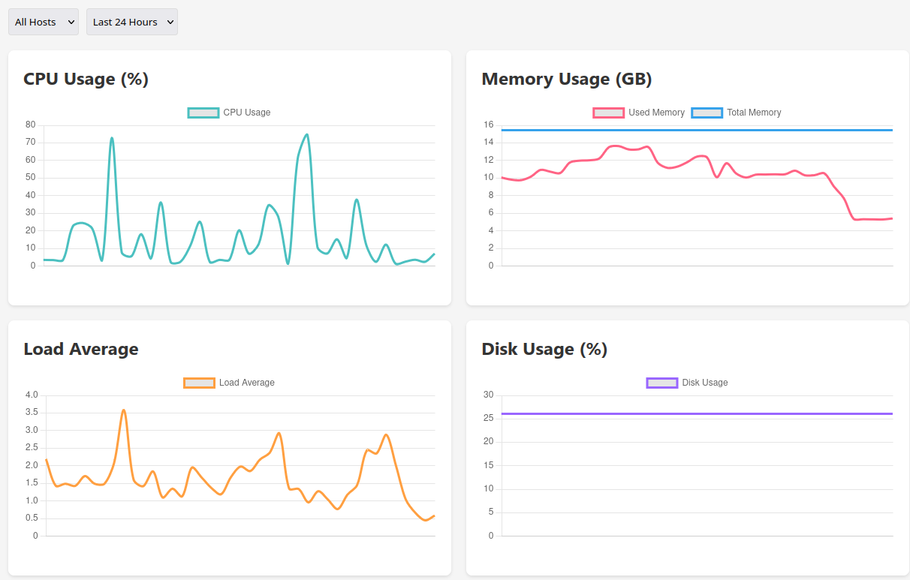

# cf-worker-probe

Serverless VPS probe for your server. Based on Cloudflare Worker with Static Assets + D1. Single deployment, no-deps.

## Usage

### 1. Deploy

```sh
wrangler d1 execute probe --file=schema.sql
wrangler deploy
```

### 2. Configure client.sh

```sh
WORKER_URL="https://your-worker.workers.dev/api"
```

Run on your VPS. Create a systemd service for persistence.

---

Install inetutils if missing hostname command.

## Screenshot


